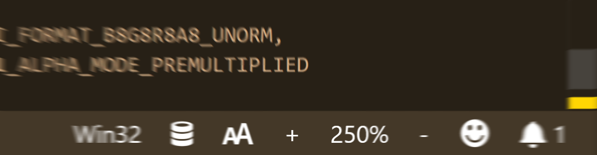
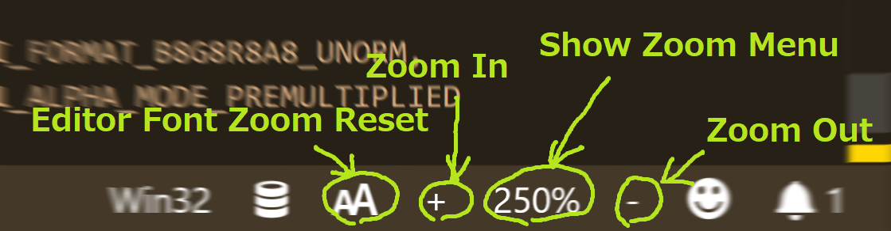
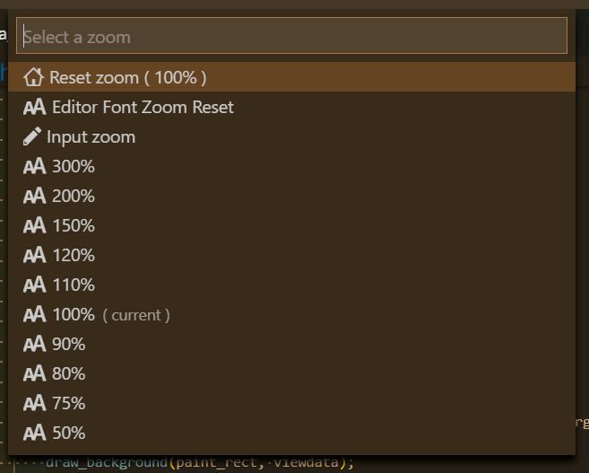

# Zoom Bar README

Zoom UI in status bar for vscode.

## Features

Can zoom via GUI in status bar.

## Tutorial

### 0. ⬇️ Install Zoom Bar

Show extension side bar within VS Code(Mac:<kbd>Command</kbd>+<kbd>Shift</kbd>+<kbd>X</kbd>, Windows and Linux: <kbd>Ctrl</kbd>+<kbd>Shift</kbd>+<kbd>X</kbd>), type `zoombar-vscode` and press <kbd>Enter</kbd> and click <kbd>Install</kbd>. Restart VS Code when installation is completed.

### 1. 🔍 Zooming via GUI

Click `-` to zoom out, click `+` to zoom in. And click zoom percentage to show zoom menu.

### 2. 🔧 Next step

You can change [settings](#extension-settings) by `settings.json`. And you can apply [keyboard shortcuts](#keyboard-shortcut-settings) by `keybindings.json`.

Enjoy!

## Commands

* `Zoom Bar: Select Zoom` : zoom by preset or input
* `Zoom Bar: Reset Zoom` : reset zoom
* `Zoom Bar: Zoom In` : zoom in
* `Zoom Bar: Zoom Out` : zoom out

## Extension Settings

This extension contributes the following settings by [`settings.json`](https://code.visualstudio.com/docs/customization/userandworkspace#_creating-user-and-workspace-settings)( Mac: <kbd>Command</kbd>+<kbd>,</kbd>, Windows / Linux: <kbd>File</kbd> -> <kbd>Preferences</kbd> -> <kbd>User Settings</kbd> ):

* `zoombar.defaultZoom`: set default zoom
* `zoombar.zoomUnit`: set zoom unit
* `zoombar.zoomUnitType`: set zoom unit type
* `zoombar.preview`: temporarily apply the zoom before confirming.
* `zoombar.zoomPreset`: set zoom preset
* `zoombar.zoomInLabel`: set zoom in's label
* `zoombar.zoomOutLabel`: set zoom out's label
* `zoombar.fontZoomResetLabel`: set `Editor Font Zoom Reset`'s label
* `zoombar.uiDisplayOrder`: set zoom UI display order
* `zoombar.configurationTarget`: configuration target scope.

You can embed icons in the label text( `zoombar.zoomInLabel`,  `zoombar.zoomOutLabel` ) by leveraging the syntax:

`My text $(icon-name) contains icons like $(icon'name) this one.`

Where the icon-name is taken from the [octicon](https://octicons.github.com) icon set, e.g. `light-bulb`, `thumbsup`, `zap` etc.

You can specify unicode characters ( include emoji ) as label text too.

## Keyboard shortcut Settings

In default, Zoom bar's commands doesn't apply keyboard shortcuts. Althogh,
you can apply keyboard shortcuts by [`keybindings.json`](https://code.visualstudio.com/docs/customization/keybindings#_customizing-shortcuts)
( Mac: <kbd>Code</kbd> -> <kbd>Preferences</kbd> -> <kbd>Keyboard Shortcuts</kbd>, Windows / Linux: <kbd>File</kbd> -> <kbd>Preferences</kbd> -> <kbd>Keyboard Shortcuts</kbd>).

Command name on `keybindings.json` is diffarent from on Command Pallete. See below table.

|on Command Pallete|on keybindings.json|
|-|-|
|`Zoom Bar: Select Zoom`|`zoombar-vscode.selectZoom`|
|`Zoom Bar: Reset Zoom`|`zoombar-vscode.resetZoom`|
|`Zoom Bar: Zoom In`|`zoombar-vscode.zoomIn`|
|`Zoom Bar: Zoom Out`|`zoombar-vscode.zoomOut`|

## Release Notes

see ChangLog on [marketplace](https://marketplace.visualstudio.com/items/wraith13.zoombar-vscode/changelog) or [github](https://github.com/wraith13/zoombar-vscode/blob/master/CHANGELOG.md)

## Support

[GitHub Issues](https://github.com/wraith13/zoombar-vscode/issues)

## License

[Boost Software License](https://github.com/wraith13/zoombar-vscode/blob/master/LICENSE_1_0.txt)

## Download VSIX file ( for VS Code compatible softwares )

[Releases · wraith13/zoombar-vscode](https://github.com/wraith13/zoombar-vscode/releases)

## Other extensions of wraith13's work

|Icon|Name|Description|
|---|---|---|
| |[Bracket Lens](https://marketplace.visualstudio.com/items?itemName=wraith13.bracket-lens)|Show bracket header on closing bracket.|
| |[Zoom Bar](https://marketplace.visualstudio.com/items?itemName=wraith13.zoombar-vscode)|Zoom UI in status bar for VS Code.|
| |[Unsaved Files](https://marketplace.visualstudio.com/items?itemName=wraith13.unsaved-files-vscode)|Easy access to unsaved files for VS Code.|

See all wraith13's  expansions: <https://marketplace.visualstudio.com/publishers/wraith13>
